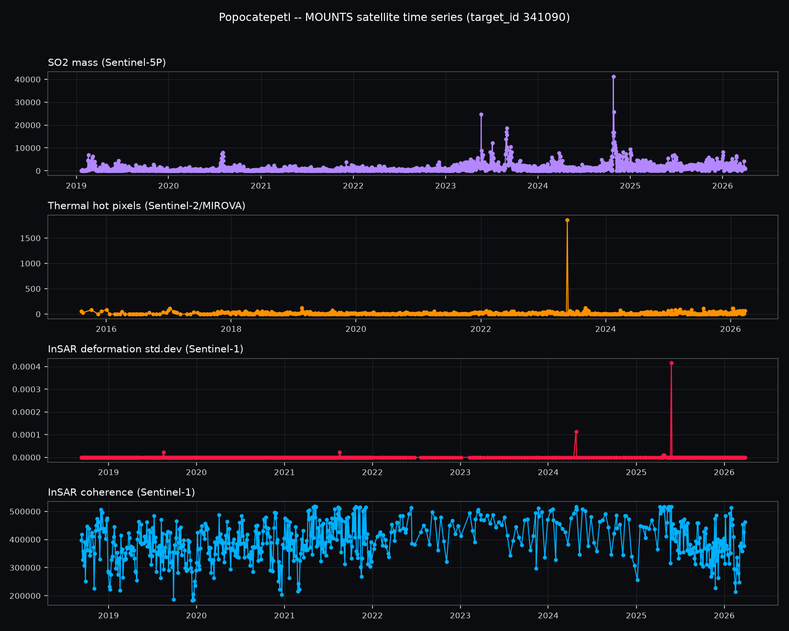
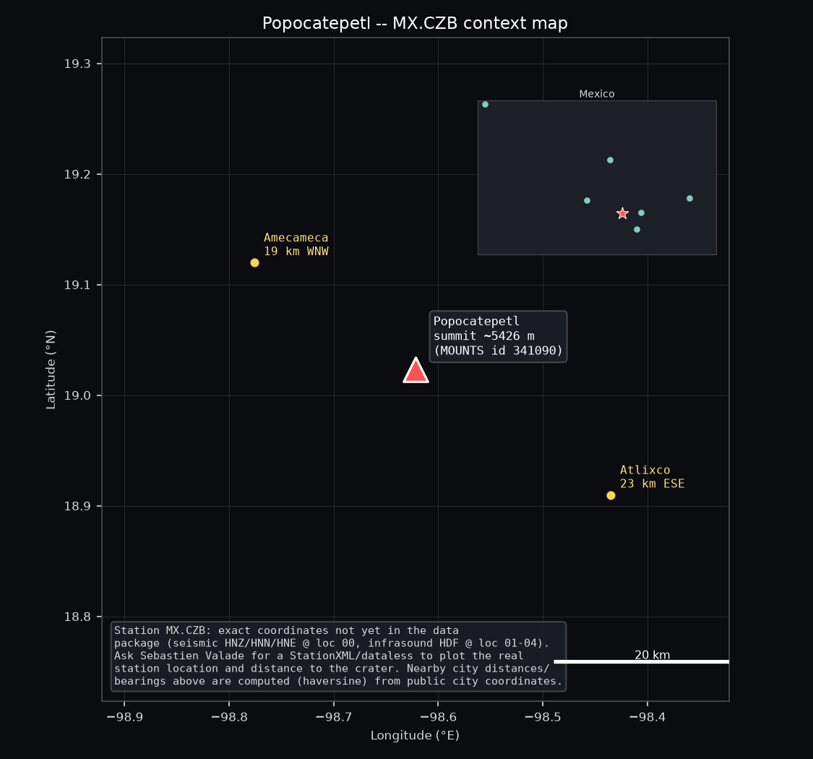
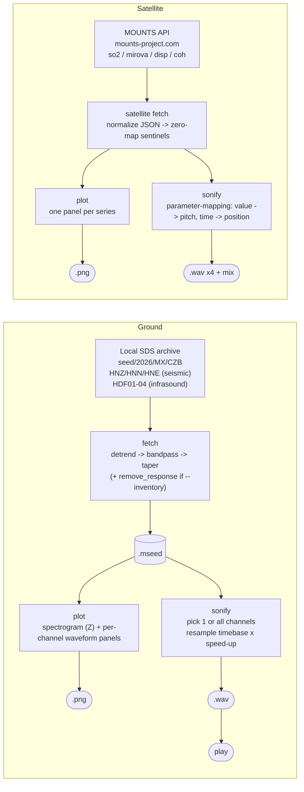

# POPO01 -- Popocatepetl Sonification Toolkit

A single-file Python CLI that turns **Popocatepetl volcano (Mexico)** monitoring
data into sound, from two independent sources at once:

- **Ground**: seismic + infrasound waveform data for station **MX.CZB**, provided
  by Sebastien Valade ([MOUNTS observatory](http://mounts-observatory.org/views/341090)),
  read from a local SDS archive and **audified** (sped up until inaudible ground
  motion becomes audible sound).
- **Satellite**: SO2 mass, thermal hot-pixel count, and InSAR deformation/coherence
  time series pulled live from the [MOUNTS API](http://mounts-project.com/api/doc)
  and turned into sound via **parameter-mapping sonification** (pitch and timing
  driven directly by each measurement).

It keeps a plain, auditable approach throughout: standard
[ObsPy](https://docs.obspy.org/) waveform processing, a transparent
"resample the timebase" audification method for ground data, and no
proprietary DSP or hidden steps anywhere.

**Scientific data:** Sebastien Valade (MOUNTS observatory) -- ground data;
MOUNTS API -- satellite data
**License:** GNU General Public License v3.0 (see [LICENSE](LICENSE))

---

## Preview

Real output, generated by this toolkit from Sebastien Valade's full MOUNTS
historical export for Popocatepetl (2015-2026, thousands of real measurements) --
not mockups or synthetic placeholders.

**Where + what**: the `satellite` action now renders one combined figure --
the four MOUNTS series stacked on the left, and a real-geography context map
(nearby cities with computed distance/bearing, compass rose, scale bar, and a
"where in Mexico" locator inset, all from real public coordinates) on the
right, so location and activity read as a single explanation instead of two
disconnected images (run `python POPO01.py satellite --play` to also generate
and listen to the `.wav` files locally -- they aren't committed to the repo,
see [Output folder layout](#output-folder-layout)):



**Standalone context map** (same map, on its own), generated by the `map` action:



> The ground (seismic + infrasound) waveform plot isn't shown here yet -- it
> depends on Sebastien Valade's WeTransfer SDS archive, which hasn't been
> unzipped into `seed/` in this environment. The satellite pipeline above,
> the `map` action, and the whole ground pipeline's code path are otherwise
> fully implemented and tested; see [Data sources and limitations](#data-sources-and-limitations).

---

## Table of contents

- [Preview](#preview)
- [What it does](#what-it-does)
- [Pipeline overview](#pipeline-overview)
- [Station and volcano](#station-and-volcano)
- [How it works](#how-it-works)
  - [A. Ground: fetch / plot / sonify / play / map](#a-ground-fetch--plot--sonify--play--map)
  - [B. Satellite: fetch / plot / sonify](#b-satellite-fetch--plot--sonify)
- [Installation](#installation)
- [Quick start](#quick-start)
- [Command-line reference](#command-line-reference)
- [Recipes](#recipes)
- [Understanding `--listen-minutes`](#understanding---listen-minutes)
- [Zero-mapping sentinel values](#zero-mapping-sentinel-values)
- [Output folder layout](#output-folder-layout)
- [Driving a REAPER volume envelope and a GPIO LED from the satellite data](#driving-a-reaper-volume-envelope-and-a-gpio-led-from-the-satellite-data)
- [Data sources and limitations](#data-sources-and-limitations)
- [Known limitations / things to be aware of](#known-limitations--things-to-be-aware-of)
- [Design notes](#design-notes)
- [Contributing](#contributing)
- [Citation](#citation)
- [License](#license)

---

## What it does

`POPO01.py` is a single entry point with actions that can be combined freely on
the command line:

| Action      | Pipeline  | What it does                                                                 |
|-------------|-----------|-------------------------------------------------------------------------------|
| `fetch`     | Ground    | Reads a window of raw waveform data from the local SDS archive, filters it, and saves it as `.mseed`. |
| `plot`      | Ground    | Renders a dark, spectrogram + per-channel waveform figure. Saved as `.png`.   |
| `sonify`    | Ground    | Speeds up one (or every) channel's waveform into an audible `.wav`.           |
| `play`      | Ground    | Plays a `.wav` file straight from the terminal (Windows/macOS/Linux).         |
| `map`       | Ground    | Prints/plots the station + volcano location. No waveform data fetched.       |
| `satellite` | Satellite | Fetches MOUNTS SO2/thermal/InSAR series, plots them, and sonifies each (+ a combined mix) as `.wav`. |
| `all`       | Ground    | Shorthand for `fetch plot sonify`.                                            |

By default, running the script with no arguments does `fetch plot sonify` on the
default ~2-hour eruption window from the one archived day of ground data.

## Pipeline overview



## Station and volcano

| | |
|---|---|
| Network / Station | `MX.CZB` |
| Volcano | Popocatepetl, Mexico (Smithsonian/MOUNTS id `341090`) |
| Seismic channels | `HNZ`, `HNN`, `HNE` -- strong-motion accelerometer, location `00` |
| Infrasound channels | `HDF` -- four co-located sensors, locations `01`-`04` |
| Summit coordinates | 19.023 N, -98.622 E, 5426 m (public Smithsonian/GVP data) |
| Data provider (ground) | Sebastien Valade, MOUNTS observatory |
| Data source (satellite) | [MOUNTS API](http://mounts-project.com/api/doc) |

CZB's own precise station coordinates were not included in the ground data
package -- the `map` action currently plots the public summit location. Ask
Sebastien Valade for the station StationXML/dataless if exact station
lat/lon/elevation/distance-to-crater is needed later.

The MOUNTS website also reports an "IP" (infrasonic parameter) that rises
during ongoing eruptive activity -- that's when the infrasound channels
(`HDF01`-`HDF04`) are most interesting to listen to.

---

## How it works

### A. Ground: fetch / plot / sonify / play / map

#### 1. Fetch

`do_fetch()` uses `obspy.clients.filesystem.sds.Client` to read a time window
directly from a **local SDS archive** (`--sds-root`, default `seed/`) --
there is no live FDSN server for this station yet, so there's no
"now minus latency" polling logic. Instead, the only currently-archived day is
**2026-03-27** (the day of the last explosive activity), and you pick a window
within it:

- `--full-day` uses the entire archived day.
- `--start HH:MM` / `--end HH:MM` (UTC) picks a custom window.
- By default, the window centers on the known eruption at `07:00 UTC`, from
  `--before-min` (default 30) minutes before to `--after-min` (default 90)
  minutes after.

`--channels seismic` / `infrasound` / `all` (default) selects which of the
7 available channels to fetch. Each channel family gets its own bandpass:

1. `detrend("demean")` + `detrend("linear")` -- remove DC offset and drift.
2. `filter("bandpass", ...)` -- `--freqmin`/`--freqmax` (default 0.5-10 Hz) for
   seismic, `--infra-freqmin`/`--infra-freqmax` (default 0.05-20 Hz) for
   infrasound.
3. `taper(0.125)` -- cosine taper on both ends to avoid filter edge artifacts.
4. `remove_response()` only if `--inventory PATH` (StationXML/dataless) is
   supplied -- otherwise data stays in raw digitizer counts (no instrument
   metadata was included in the WeTransfer package).

Saved as MiniSEED (`.mseed`) under `datasets/ground/mseed/`, with a `.json`
sidecar recording the exact window and filters used (read back automatically
by `plot`).

#### 2. Plot

`do_plot()` renders one dark-themed figure per `.mseed` file: a spectrogram of
the vertical/first channel on top (dashed lines at `freqmin`/`freqmax`, solid
green line at the dominant frequency), and one labeled waveform panel per trace
below, colored and shaded by channel family, with a shared absolute time axis
scaled to the recording's actual duration. Saved as `.png` under
`datasets/ground/plot/`.

#### 3. Sonify

`do_sonify()` normalizes trace data to -1..1 and writes 16-bit PCM `.wav`
audio. By default it picks the first available trace; `--channel all` sonifies
every trace into its own `.wav` instead. Speeding up keeps every sample and
just multiplies the **declared** sample rate by
`--speed-up` (default 200), a linear time/frequency stretch (not
pitch-preserving), moving inaudible ground motion / pressure signal up into
the audible range:

```
output_duration = input_duration / speed_up_factor
```

#### 4. Play

`do_play()` plays a `.wav` using the OS's native player: `winsound` (Windows,
stdlib), `afplay` (macOS), or `paplay`/`aplay`/`ffplay` (Linux, whichever is
found).

#### 5. Map

`do_map()` prints the station/volcano coordinates and saves a real-geography
context map (nearby cities, distances/bearings, compass rose, scale bar,
"where in Mexico" locator inset) to `datasets/maps/`. No waveform data is
fetched; no `cartopy`/internet tiles are required -- see
[draw_context_map()](#b-satellite-fetch--plot--sonify) below.

### B. Satellite: fetch / plot / sonify

Ground audification only works because there's a continuous waveform to speed
up. The four MOUNTS satellite series are sparse and irregularly sampled (one
measurement every few days, not every millisecond), so this uses a different,
complementary method instead: **parameter-mapping sonification**, the standard
approach for sonifying irregular scientific time series.

| Series | Source | Frequency band used |
|---|---|---|
| `so2` -- SO2 mass | Sentinel-5P | 220-440 Hz |
| `mirova` -- thermal hot pixels | Sentinel-2 / MIROVA | 440-880 Hz |
| `disp` -- InSAR deformation std.dev | Sentinel-1 | 80-220 Hz |
| `coh` -- InSAR coherence | Sentinel-1 | 880-1760 Hz |

`do_satellite()` runs, per selected type (`--sat-types`, default `all`), from
one of two interchangeable sources:

- **A local MOUNTS Excel export** (`load_mounts_xlsx()`) -- if a
  `datasets/MOUNTS_*.xlsx` file is present (e.g. Sebastien Valade's full
  historical export, one sheet per data type: `Sentinel-5P`, `Sentinel-2`,
  `Sentinel-1_disp`, `Sentinel-1_coh`), it is used automatically and
  preferred over the live API, since it's the **complete historical record**
  rather than just recent data -- for Popocatepetl this currently spans
  **2015-2026**, thousands of real measurements per series, clearly showing
  multiple real eruptive episodes (SO2 and thermal spikes in 2023-2025).
  Pass `--sat-xlsx PATH` to point at a specific file, or `--sat-live` to
  force the live API even when a local export is found.
- **The live MOUNTS API** (`mounts_query()`) -- `GET
  http://mounts-project.com/api/query` with
  `table=results_dat&target_id=341090&type='<type>'&column=time,data,type`
  (+ an optional `time=>START,<END` range filter). Raw JSON is saved under
  `datasets/satellite/raw/` for inspection (`--sat-debug` prints it too).

Both sources feed the same downstream pipeline:

1. **Normalize** `normalize_mounts_response()` -- the live API (verified July
   2026) returns a JSON list of row dicts, e.g.
   `[{"data": 3785.5, "time": "Sun, 25 Feb 2024 20:02:42 GMT", "type": "so2"}, ...]`,
   parsed into `(epoch_seconds, value)` pairs. Timestamps are RFC 2822
   (`email.utils.parsedate_to_datetime`), with an ISO 8601 fallback in case a
   future API revision changes format. A few defensive fallback shapes
   (dict-of-parallel-arrays, nested container keys) are also handled in case
   the API's shape changes.
2. **Zero-map** `apply_zero_mapping()` -- replaces known "no detection"
   sentinel values with `0` (see [below](#zero-mapping-sentinel-values)).
3. **Plot** `do_satellite_plot()` -- one panel per series stacked on the
   left, and a real-geography context map (`draw_context_map()`: nearby
   cities with computed distance/bearing, compass rose, scale bar, "where in
   Mexico" locator inset) on the right, all in a single combined figure
   saved to `datasets/satellite/plot/popo_satellite.png`.
4. **Sonify** `sonify_timeseries()` -- each `(time, value)` point becomes a
   short pitched grain (150 ms, raised-cosine envelope, no clicks): **pitch**
   is the value log-mapped within that series' own observed min/max onto its
   frequency band, and **position in the output audio** is the measurement's
   real timestamp, linearly compressed so the whole series fits into
   `--listen-minutes` (default 2). Each type gets its own `.wav`
   (`datasets/satellite/sonifications/popo_<type>.wav`) plus a combined,
   normalized mix (`popo_satellite_mix.wav`) so all four stay audible and
   distinguishable together (deformation low, coherence high).

---

## Installation

Requires Python 3.9+.

```powershell
# Create a virtual environment named .venv (the conventional name every
# editor/tool auto-detects) and install dependencies into it
python -m venv .venv
.venv\Scripts\activate
pip install -r requirements.txt
```

Dependencies: [ObsPy](https://docs.obspy.org/) (SDS archive client +
seismological processing), NumPy, SciPy (spectrogram + WAV I/O), Matplotlib
(plotting), and [openpyxl](https://openpyxl.readthedocs.io/) (reads the local
MOUNTS Excel export used by the satellite pipeline). The live MOUNTS API path
only needs Python's stdlib `urllib`.

## Quick start

```powershell
# 1. Unzip the WeTransfer SDS archive so it creates:
#    seed/2026/MX/CZB/HNE.D, HNN.D, HNZ.D, HDF.D/...
#    (right here in this project folder, or pass --sds-root elsewhere)

# 2. Ground: fetch + plot + sonify the ~2h eruption window (default)
python POPO01.py

# 3. Satellite: fetch + plot + sonify all four MOUNTS series, right now,
#    no ground data needed
python POPO01.py satellite --play
```

## Command-line reference

```
python POPO01.py [actions ...] [options]
```

**Actions** (positional, any combination, default `fetch plot sonify`):
`fetch`, `plot`, `sonify`, `play`, `map`, `satellite`, `all` (shorthand for
`fetch plot sonify`).

**Ground data (SDS archive):**

| Option | Default | Description |
|---|---|---|
| `--sds-root PATH` | `seed/` | Local SDS archive root. |
| `--channels seismic\|infrasound\|all\|LIST` | `all` | Which channels to fetch: `seismic` (HNZ/HNN/HNE), `infrasound` (HDF01-04), `all`, or a comma-list of tokens. |
| `--inventory PATH` | none | StationXML/dataless for MX.CZB, to remove the instrument response. |

**Time window** (data currently only covers 2026-03-27):

| Option | Default | Description |
|---|---|---|
| `--date YYYY-MM-DD` | `2026-03-27` | Archived date. |
| `--start HH:MM` | — | Window start, UTC. |
| `--end HH:MM` | — | Window end, UTC. |
| `--full-day` | off | Use the entire archived day. |
| `--before-min MIN` | `30` | Minutes before the 07:00 UTC eruption to start the default window. |
| `--after-min MIN` | `90` | Minutes after the eruption to end the default window. |

**Bandpass filters:**

| Option | Default | Description |
|---|---|---|
| `--freqmin HZ` | `0.5` | Seismic lower corner. |
| `--freqmax HZ` | `10.0` | Seismic upper corner. |
| `--infra-freqmin HZ` | `0.05` | Infrasound lower corner. |
| `--infra-freqmax HZ` | `20.0` | Infrasound upper corner. |

**Sonify options:**

| Option | Default | Description |
|---|---|---|
| `--speed-up N` | `200` | Ground playback speed multiplier. |
| `--channel SUBSTRING\|all` | first trace | Which channel to sonify (substring match, e.g. `HNZ`, `HDF01`), or `all` for every channel into its own `.wav`. |
| `--listen-minutes MIN` | — | Ground: target sonification length. Satellite: length of the parameter-mapped piece (default 2). |

**File selection (skip fetching):**

| Option | Description |
|---|---|
| `--list` | List saved `.mseed` files with index numbers, then exit. |
| `--pick INDEX` | Use the file at `INDEX` from `--list` instead of fetching. |
| `--file PATH` | Use a specific `.mseed` file path instead of fetching. |

**Satellite data (MOUNTS API):**

| Option | Default | Description |
|---|---|---|
| `--target-id ID` | `341090` | MOUNTS/Smithsonian volcano id. |
| `--sat-types LIST\|all` | `all` | Comma-list from `so2,mirova,disp,coh`, or `all`. |
| `--sat-start YYYY-MM-DD` | — | Series start date. |
| `--sat-end YYYY-MM-DD` | — | Series end date. |
| `--sat-days-back N` | `365` | If start/end aren't given, fetch this many days back from now. |
| `--sat-debug` | off | Print/keep the raw MOUNTS JSON response for inspection. |
| `--sat-xlsx PATH` | auto-detected | Load series from a local MOUNTS Excel export instead of the live API. |
| `--sat-live` | off | Force the live API even if a local `datasets/MOUNTS_*.xlsx` export is auto-detected. |
| `--play` | off | Play the satellite `.wav` file(s) after sonifying. |

Run `python POPO01.py -h` at any time for the full built-in help text.

## Recipes

```powershell
# Seismic only, full default eruption window
python POPO01.py --channels seismic fetch plot sonify

# Infrasound only -- the "IP parameter" band, most interesting during
# ongoing eruptive activity
python POPO01.py --channels infrasound fetch plot sonify --channel HDF01

# The entire archived day instead of just the eruption window
python POPO01.py --full-day fetch plot

# A custom window (UTC) on the archived day
python POPO01.py --start 06:00 --end 09:00 fetch plot sonify

# Re-sonify a previously saved file at a different speed
python POPO01.py --list
python POPO01.py --pick 0 sonify --channel HNZ --speed-up 50

# Sonify every fetched channel into its own .wav
python POPO01.py --pick 0 sonify --channel all

# Station/volcano context map
python POPO01.py map

# Satellite: all four series, last 365 days, ~2 min piece each
python POPO01.py satellite

# Satellite: just SO2 and thermal, last 90 days, longer piece, auto-play
python POPO01.py satellite --sat-types so2,mirova --sat-days-back 90 --listen-minutes 3 --play

# Satellite: a specific date range
python POPO01.py satellite --sat-start 2024-02-25 --sat-end 2024-03-02

# Satellite: force the live API even if a local MOUNTS_*.xlsx export exists
python POPO01.py satellite --sat-live

# Satellite: use a specific local MOUNTS Excel export
python POPO01.py satellite --sat-xlsx path/to/MOUNTS_popocatepetl_export.xlsx
```

## Understanding `--listen-minutes`

- **Ground:** when fetching, it computes how much raw data to request
  (`--listen-minutes * --speed-up`); when reusing a saved file, it instead
  computes `--speed-up` for you from the file's actual length.
- **Satellite:** simpler, since each series already only has a handful of
  sparse points -- `--listen-minutes` (default 2) just sets the total output
  duration that all the series' points are spread across, in real
  chronological order.

## Zero-mapping sentinel values

Per Sebastien Valade's note, the MOUNTS API uses placeholder values for
"no detection", which are mapped to `0` before plotting/sonifying so they
don't register as extreme, meaningless spikes:

| Type | Sentinel value | Mapped to |
|---|---|---|
| `so2` | `0.1` | `0` |
| `mirova` | `100000` | `0` |

This has been confirmed against real data: a live query returned `100000.0`
for `mirova` multiple times (correctly zeroed) alongside one real detection
(`8000000.0`, left untouched). `disp` and `coh` have no known sentinel and are
passed through unchanged.

## Output folder layout

Created automatically next to the script on first run:

```
seed/                              # unzip the WeTransfer SDS archive here
datasets/
├── ground/
│   ├── mseed/                     # processed ground waveform data (.mseed) + .json sidecar
│   ├── plot/                      # ground spectrogram + waveform plots (.png)
│   └── sonifications/             # ground audio (.wav)
├── maps/                          # station/volcano context map (.png)
└── satellite/
    ├── raw/                       # raw MOUNTS API JSON responses
    ├── plot/                      # satellite time-series + map plot (.png)
    ├── sonifications/             # satellite parameter-mapping audio (.wav)
    └── envelopes/                 # per-series 0..1 control-curve CSVs (REAPER / GPIO, see below)
docs/images/                       # static copies of real output, committed to
                                    # git for the README preview above -- everything
                                    # under datasets/ is regenerated locally instead
reaper/                            # ReaScript to import an envelope CSV as a REAPER volume envelope
gpio/                               # Raspberry Pi script to drive an LED's brightness from an envelope CSV
```

Ground and satellite outputs are nested under their own subfolder
(`datasets/ground/*`, `datasets/satellite/*`) precisely so folder names like
`plot` or `sonifications` never exist twice ambiguously at the same level.

Saved data is not tracked in git (see `.gitignore`) -- only the folder
structure is, via `.gitkeep` placeholders.

## Driving a REAPER volume envelope and a GPIO LED from the satellite data

Every `satellite sonify` run also writes a **control-curve CSV** per series to
`datasets/satellite/envelopes/popo_<type>_envelope.csv`
(`export_envelope_csv()`): columns `time_s, value_norm, value_raw`, uniformly
resampled at 30 fps across the exact same compressed `--listen-minutes`
timeline used for that series' `.wav`. `value_norm` is the same 0..1 mapping
sonification already uses for pitch, just interpolated into a smooth
continuous curve instead of discrete grains -- so it's a ready-made fader /
brightness curve, already time-aligned with the audio.

**REAPER volume envelope** -- [`reaper/import_satellite_envelope.lua`](reaper/import_satellite_envelope.lua):
1. Drop the `.wav` (e.g. `popo_so2.wav` or the combined `popo_satellite_mix.wav`)
   onto a track, and make sure that track's **Volume** envelope is visible
   (right-click the fader / the arrow under the track name -> `Volume`).
2. Select the track, then run the script (Actions List -> Load ReaScript...).
3. Pick the matching CSV -- it inserts one envelope point per row (linear
   segments), mapped onto a tunable gain range (`MIN_GAIN`/`MAX_GAIN` at the
   top of the script, 1.0 = unity/0 dB).

Playing the track from the start now fades its volume up and down exactly in
step with the real satellite measurements.

**GPIO LED brightness** -- [`gpio/play_satellite_envelope.py`](gpio/play_satellite_envelope.py)
(Raspberry Pi, `gpiozero`/`PWMLED`):
```bash
python3 play_satellite_envelope.py --csv popo_so2_envelope.csv --pin 18
```
Reads the same CSV and sets `PWMLED.value` frame-by-frame on a wall-clock
timer, with a brightness floor (`--min-brightness`, default 10%) so the LED
never goes fully dark between measurements. Start it at the same moment as
the matching REAPER track (or the raw `.wav` playback) to keep sound and
light synchronized; `--loop` repeats the curve indefinitely for an
installation left running unattended.

Because both the REAPER envelope and the GPIO brightness are driven from the
same CSV (which shares its timeline with the audio), all three -- sound,
fader automation, and physical light -- stay in sync without any additional
clock/timecode sync between REAPER and the Pi.

## Data sources and limitations

- **Ground:** SDS archive supplied by Sebastien Valade (MOUNTS observatory)
  for network `MX`, station `CZB`, covering one day (2026-03-27, the last
  explosive activity). Website:
  [mounts-observatory.org/views/341090](http://mounts-observatory.org/views/341090).
  No instrument response metadata was included, so data stays in raw
  digitizer counts unless a StationXML/dataless is supplied via
  `--inventory`. There is no live FDSN server for this station at the time
  of writing -- an FDSN endpoint may be set up later, at which point the
  fetch logic would need to switch to `obspy.clients.fdsn.Client`.
- **Satellite:** two interchangeable sources:
  - A local **MOUNTS Excel export** (`datasets/MOUNTS_*.xlsx`), auto-detected
    when present -- the complete historical record (e.g. 2015-2026 for
    Popocatepetl, thousands of real measurements per series). Not tracked in
    git (see `.gitignore`); place your own export there to use it.
  - The live [MOUNTS API](http://mounts-project.com/api/doc),
    `http://mounts-project.com/api/query`, volcano id `341090` (Popocatepetl).
    Note this endpoint is plain HTTP (not HTTPS) -- that is the server's own
    configuration, not something this script controls. Verified live in July
    2026 for all four series (`so2`, `mirova`, `disp`, `coh`); the exact JSON
    shape and RFC 2822 timestamp format documented above were confirmed
    against real responses, not just the API documentation.
- This is a small utility script, not a package -- there are no automated
  tests. It has been manually exercised for the CLI paths described in this
  README, including validating the full satellite pipeline (query,
  normalize, zero-map, plot, sonify) against real MOUNTS API responses.

## Known limitations / things to be aware of

- Sonification always converts to mono 16-bit PCM; a silent/near-zero window
  produces silent audio (physically accurate, not a bug).
- `--speed-up`, `--freqmin`/`--freqmax`, `--infra-freqmin`/`--infra-freqmax`,
  and `--listen-minutes` are validated to be positive/consistent. Malformed
  API responses, missing archive data, or network errors surface as Python
  exceptions with the underlying error message.
- If `normalize_mounts_response()` ever returns no points for a satellite
  type, run with `--sat-debug` and inspect the saved raw JSON under
  `datasets/satellite/raw/` -- the API's shape may have changed since this
  was last verified.
- CZB's exact station coordinates are a placeholder (public summit location)
  until Sebastien Valade provides precise station metadata.

## Design notes

- **No live FDSN server.** Ground data comes from a **local SDS archive**
  (`obspy.clients.filesystem.sds.Client`) instead of a live FDSN web service,
  so there's no `--latency`/backoff polling logic -- there's nothing to poll.
- **One day of data only**, so you pick a window with
  `--start`/`--end`/`--full-day`, defaulting to the known eruption window,
  rather than an `--hours-back`/`--days-back` style option.
- **One station, two sensor families** (seismic + infrasound), each with its
  own bandpass. `--channels` selects which family to fetch.
  See [Station and volcano](#station-and-volcano).
- **No instrument response by default** -- no StationXML/dataless was
  included in the data package, so data stays in raw digitizer counts unless
  one is supplied via `--inventory`.
- **Satellite sonification** is an entirely separate pipeline and
  sonification method (parameter-mapping) from the ground audification,
  since satellite measurements are sparse points rather than a continuous
  waveform.

## Contributing

Issues and pull requests are welcome -- this is meant to be a small, readable
reference implementation for turning volcano monitoring data into sound, not
a polished framework. Feel free to fork it, adapt the station/network/volcano
configuration at the top of `POPO01.py` for a different station or volcano,
or extend the sonification approach further.

## Citation

If this tool is useful in an academic or creative context, a citation or
acknowledgment along these lines is appreciated:

> *POPO01 Popocatepetl Sonification Toolkit* [Software] (2026).
> Ground data: Sebastien Valade, MOUNTS observatory. Satellite data: MOUNTS
> API (http://mounts-project.com/).

## License

Licensed under the **GNU General Public License v3.0** -- see
[LICENSE](LICENSE) for the full text. In short: you are free to use, study,
modify, and redistribute this software (including commercially), provided
derivative works are also released under the GPL-3.0 and you preserve the
copyright/license notices.

Copyright (C) 2026 RVX
